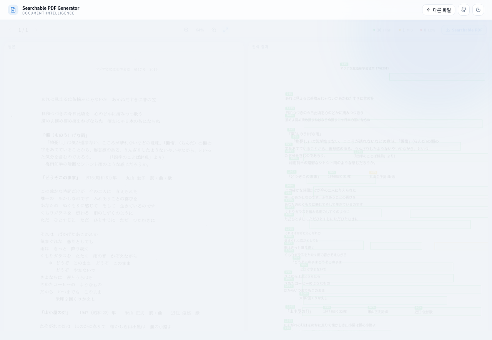
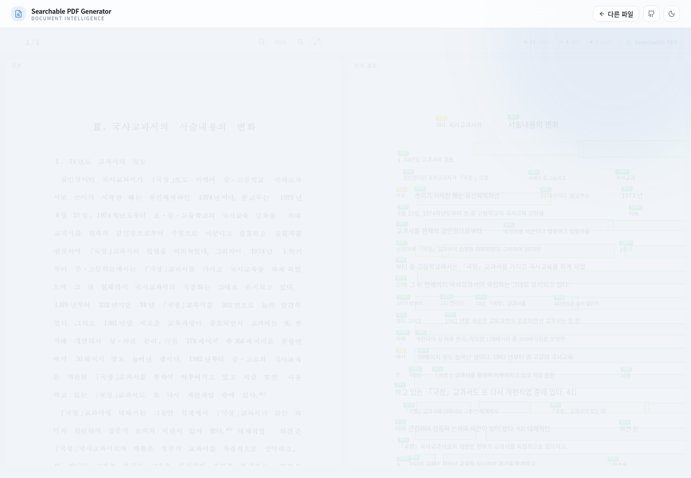

# Searchable PDF Generator

> 스캔·이미지 문서를 **검색 가능한 PDF**로 바꾸는 OCR 서비스와, 그 인식 모델을 만들며 쓴 학습·평가 도구 모음

한글·한자·영문·일본어가 섞인 한국어 문서(학술논문, 옛 행정 타자본, 한자혼용 공문서)를 대상으로
PP-OCRv5 인식 모델을 미세조정하고, 그 모델을 Searchable PDF 변환 서비스로 만들었습니다.

**👉 [데모 열기](https://dnss1.github.io/searchable-pdf-generator/)**

<!-- 📸 대표 이미지 1장 (선택): 결과 화면을 가장 잘 보여주는 캡처. 없으면 이 줄을 지워도 됩니다 -->


---

## 📌 무엇을 하는 서비스인가

종이 문서를 스캔하면 사람 눈에는 글자가 보이지만, 컴퓨터에는 그냥 **그림**입니다.
검색도, 복사도, 글자 수 세기도 안 됩니다.

이 서비스는 문서 이미지를 받아

1. **글자가 있는 영역을 찾고** (텍스트 검출)
2. **그 영역의 글자를 읽고** (문자 인식)
3. **사람이 읽는 순서대로 정렬한 뒤** (다단·세로쓰기 처리)
4. **원본 이미지 위에 보이지 않는 텍스트 층을 겹쳐** PDF로 만듭니다.

결과 PDF는 겉보기엔 원본과 똑같지만, `Ctrl+F`로 검색하고 드래그해서 복사할 수 있습니다.

일반 OCR 모델은 한국어 문서에 **한자·일본어가 섞이면 크게 무너집니다.**
공식 한국어 모델로는 일중 혼재 문서 정확도가 30%대였고, 이를 다국어 미세조정으로 **89.96%** 까지 끌어올렸습니다.

---

## 🖥️ 데모 화면

> 데모는 브라우저에서 모델을 돌리지 않습니다. 미리 계산한 실제 인식 결과를 정적 파일로 보여줍니다 ([이유](#왜-업로드를-받지-않나)).

### 1. 시작 화면 — 샘플 문서 선택

<!-- 📸 캡처: 첫 화면. 샘플 카드 4장이 보이게 -->


석사 학위연구 평가셋에서 도메인별로 한 장씩 뽑은 문서 4종 중 하나를 고르고 `인식 시작`을 누릅니다.

### 2. 인식 진행

<!-- 📸 캡처: '인식 시작' 직후 진행 바와 단계 메시지(레이아웃 감지 / 텍스트 영역 검출 / 문자 인식 …)가 보이는 순간 -->
<!--  -->

실제 파이프라인과 같은 순서로 진행 단계가 표시됩니다 —
페이지 변환 → 레이아웃 감지 → 텍스트 영역 검출 → 문자 인식 → 읽기 순서 정렬 → 텍스트 레이어 생성.

### 3. 결과 비교 — 원본 ↔ 인식 결과

<!-- 📸 캡처: 결과 화면 상단. 왼쪽 원본, 오른쪽 인식 결과(색깔 박스)가 나란히 보이게 -->


왼쪽은 원본, 오른쪽은 **인식된 글자를 원래 좌표에 다시 그린 화면**입니다.
글자가 실제로 그 자리에 있는지 눈으로 바로 대조할 수 있습니다.

- 박스 색 = 라인 신뢰도 (🟩 0.90 이상 · 🟨 0.70 이상 · 🟥 0.70 미만)
- 2단 문서는 `더블 컬럼` 배지와 **단 경계선**이 표시됩니다
- 좌우 화면은 스크롤·확대가 함께 움직입니다

**빨간 박스는 실패한 라인입니다.** 잘 된 결과만 골라 보여주지 않았습니다.

### 4. 라인 목록과 신뢰도

<!-- 📸 캡처: 결과 화면 하단의 라인 리스트. 한 줄에 마우스를 올려 오른쪽 박스가 강조되는 모습이면 더 좋음 -->
<!--  -->

인식된 줄이 읽기 순서대로 나열됩니다. 줄에 마우스를 올리면 해당 위치가 강조되고, 클릭하면 그 위치로 이동합니다.
검수자가 **신뢰도 낮은 줄만 골라서** 확인할 수 있게 만든 화면입니다.

### 5. 어려운 문서 — 1988년 인쇄물 스캔

<!-- 📸 캡처: 'C1 · 옛 스캔' 샘플 결과 화면 -->


노이즈와 저대비가 섞인 구간에서 신뢰도가 떨어지는 모습이 그대로 보입니다.

### 6. 결과물 — 검색 가능한 PDF

<!-- 📸 캡처: 'Searchable PDF' 버튼으로 받은 PDF를 뷰어에서 열고 Ctrl+F 로 단어를 검색해 하이라이트된 모습 -->
<!--  -->

툴바의 `Searchable PDF` 버튼으로 받은 파일입니다. 겉보기는 원본 그대로인데 `Ctrl+F` 검색과 텍스트 복사가 됩니다.

---

## ✨ 주요 기능

| 기능 | 설명 |
|---|---|
| **다국어 혼재 인식** | 한글 · 한자 · 영문 · 일본어 · 중국어가 한 줄에 섞여도 하나의 모델로 인식 |
| **읽기 순서 복원** | 다단 가로쓰기는 단을 먼저 나누고, 세로쓰기는 우→좌로 정렬 |
| **투명 텍스트 레이어** | 원본 화질을 유지한 채 보이지 않는 텍스트를 얹어 검색·복사 가능한 PDF 생성 |
| **신뢰도 시각화** | 줄마다 신뢰도를 색으로 표시해 검수할 곳을 바로 찾음 |

원래 서비스에는 TXT · XML · CSV · JSON 내보내기와 파일 업로드가 있었지만, 공개 데모에는 넣지 않았습니다.

---

## 📊 성능

PP-OCRv5를 4단계 전이 학습으로 미세조정한 결과입니다. 비교 대상은 PaddleOCR 공식 한국어 특화 모델이고, 같은 평가 스크립트 · 같은 검출 단계 기준입니다.

| 평가셋 | 지표 | 공식 한국어 모델 | 본 연구 | 개선 |
|---|---|---:|---:|---:|
| 자체 구축 75p · 2,199라인 | Char Acc | 83.81% | **96.24%** | +12.43%p |
| KCI 학술논문 · 5p | F1 | 75.39% | **97.13%** | +21.74%p |
| 옛 행정 타자본 · 3,564라인 | Char Acc | 88.13% | **94.58%** | +6.45%p |
| 옛 행정 타자본 · 3,564라인 | F1 | 64.01% | **83.62%** | +19.61%p |

도메인별로는 일중 혼재 **+59.46%p**(30.50 → 89.96), 옛 스캔 **+29.73%p**(64.31 → 94.04), 한자혼용 **+17.61%p** 개선했습니다.
순수 한국어 문서에서도 한국어 전용 모델을 앞섰습니다 — 다국어 학습이 표현을 공유해 얻는 이득입니다.

<!-- 📸 (선택) 학습 곡선 이미지를 보여주고 싶다면 아래 줄 유지 -->


모든 수치의 원본은 [`research/results/all_models_all_datasets.json`](research/results/all_models_all_datasets.json) 에 있습니다.

### 데모 샘플 4종

| 도메인 | 문서 | 라인 | 데모 평균 신뢰도 | 논문 Char Acc | Stage 1 대비 |
|---|---|---:|---:|---:|---:|
| A1 · 디지털 고딕 | 깨끗한 학술 문서 · 기준선 | 23 | 0.949 | 97.00% | +5.80%p |
| C1 · 옛 스캔 | 1988년 인쇄물 · 노이즈와 저대비 | 47 | 0.945 | 94.04% | +29.73%p |
| C2 · 한자혼용 | 1990년 행정문서 · 한글+한자 | 28 | 0.932 | 96.17% | +17.61%p |
| E1 · 일중 혼재 | 일본어·중국어 혼재 | 37 | 0.983 | 89.96% | +59.46%p |

4장 모두 학위연구에서 직접 구축한 평가셋(75페이지 / 8도메인)에 수록된 페이지이고,
화면의 결과는 **논문 최종 모델이 실제로 인식한 값**입니다.
데모 신뢰도는 페이지 한 장 기준이라 벤치마크 수치와 직접 비교할 값은 아닙니다.

---

## 🔍 문제 해결 기록

### 같은 가중치, 다른 결과

처음엔 운영 서비스로 데모 결과를 뽑았는데 일부 줄이 깨졌습니다. 가중치는 같았는데도요.

원인은 **인식 입력 폭**이었습니다. 서비스는 속도를 위해 검출 해상도를 낮추고 인식 입력을 기본값(320px)으로 두는데,
그러면 긴 줄이 좁은 입력에 압축되어 글자가 뭉개집니다. 50자를 320px에 넣으면 글자당 6.4px인데,
한자·한글을 구분하려면 12~16px이 필요합니다. 학위연구에서 진단했던 병목과 같은 현상이었습니다.

```
서비스 설정   det_limit 1200 · rec_image_shape 기본      → E1 평균 0.955, 깨진 라인 2건
논문 설정     det_limit 2000 · rec_image_shape 3,48,1280 → E1 평균 0.983, 깨진 라인 0건
```

[`tools/run_paper_pipeline.py`](tools/run_paper_pipeline.py) 가 논문 설정을 그대로 재현합니다.

### 지표가 서로 반대 신호를 낼 때

학술논문 평가에서 **문자 정확도 47%, F1 97%** 가 동시에 나왔습니다.
2단 레이아웃의 좌·우 단이 한 줄로 합쳐져, 글자는 다 맞았는데 순서만 틀린 경우였습니다.
이후 평가 단위별로 주 지표를 나누고, 오류를 유형별로 분해하는 [평가 프레임워크](ocr_eval/)를 만들었습니다.

잔존 오류 14.11% 중 **11.08%가 정답 라벨의 공백 불일치**였다는 것도 이 분해로 찾았습니다.

### 합성 데이터의 한계

합성 검증셋 96.51%였던 정확도가 실제 문서에서 85.58%로 떨어졌습니다. 합성 이미지에 실제 인쇄물의 열화가 없었기 때문입니다.
옛 스캔 문서를 관찰해 **긁힘 · 잉크 얼룩 · 스캐너 음영 · 입자감** 증강을 직접 구현했고([`ocr_augment/`](ocr_augment/)),
옛 스캔 도메인이 64.31% → **94.04%** 가 되었습니다.


---

## 🛠 기술 스택

| 영역 | 사용 기술 |
|---|---|
| 인식 모델 | PaddleOCR (PP-OCRv5), CTC / NRTR, TRDG 합성 데이터 |
| 데이터·평가 | Python, OpenCV, NumPy, PyMuPDF |
| 서비스 화면 | Next.js 14, TypeScript, Tailwind CSS |
| 배포 | GitHub Actions → GitHub Pages (정적 빌드) |

---

## 📁 구성

```
searchable-pdf-generator/
├── web/                     데모 (Next.js 정적 빌드)
│   ├── src/lib/api.ts       백엔드 호출 대신 fixture 를 읽는 데이터 계층
│   └── src/components/      원본 ↔ 인식 결과 비교 화면
├── research/                학위연구 산출물 — 학습 config 8종 · 스크립트 · 평가 리포트
├── ocr_eval/                평가 프레임워크 (5지표 + 오류 유형 분류)
├── ocr_augment/             학습용 문서 노이즈 증강 15종
├── tools/                   데모 데이터 생성 (추론 → fixture → Searchable PDF)
├── examples/                증강 비교 이미지
└── docs/images/             README 화면 캡처
```

| 폴더 | 자세히 |
|---|---|
| [`research/`](research/) | 단계별 학습 설정과 계보, 전체 평가 결과 |
| [`ocr_eval/`](ocr_eval/) | 왜 지표가 5개인가 — 지표가 엇갈린 사건들 |
| [`ocr_augment/`](ocr_augment/) | 증강 15종과 `empty_noise` 설계 |

평가셋 라벨 검수 도구는 별도 저장소로 분리했습니다 → **[ocr-label-review-gui](https://github.com/dnss1/ocr-label-review-gui)**

---

## 🚀 로컬 실행

```bash
cd web
npm install
npm run dev        # http://localhost:3000
```

`?s=<샘플id>` 로 특정 결과를 바로 열 수 있습니다 (예: `?s=e1-ja-zh`).

<details>
<summary>샘플 추가하기</summary>

```bash
pip install -r requirements.txt

# ① 논문 평가와 같은 설정으로 추론 (paddleocr 2.10.0 환경)
python tools/run_paper_pipeline.py \
    --image page.png --rec-dir /path/to/model \
    --id my-doc --title "표시할 이름" --description "한 줄 설명" \
    --source "문서 출처와 이용 근거" --tags 태그1 태그2

# ② 투명 텍스트 레이어 PDF 생성
python tools/make_searchable_pdf.py --fixture web/public/fixtures/my-doc.json

# ③ 재빌드
cd web && npx next build
```

</details>

---

## 왜 업로드를 받지 않나

모델 가중치와 서비스 백엔드는 공개하지 않으면서, 파이프라인이 무엇을 만들어내는지는 보여주기 위해
**미리 계산한 결과를 정적 파일로 굽는 방식**을 택했습니다.

화면은 실제 서비스의 프론트엔드를 정적 빌드한 것이고, 바뀐 건 데이터 계층(`web/src/lib/api.ts`) 하나뿐입니다.
함수 시그니처를 그대로 둬서 화면 코드는 손대지 않았습니다.

| 공개 | 비공개 |
|---|---|
| 학습 config · 코퍼스/학습/평가 스크립트 | 모델 가중치 |
| 최종 평가 리포트와 원본 지표 JSON | 학습 코퍼스 · 합성 이미지 (재배포 금지 데이터 포함) |
| 증강 · 평가 지표 패키지 | 서비스 백엔드 코드 |
| 데모 프론트엔드 | 평가셋 원본 (도메인별 1장씩만 수록) |

## 라이선스

MIT (코드). 샘플 문서는 각 fixture 의 `source` 표기를 따릅니다.
