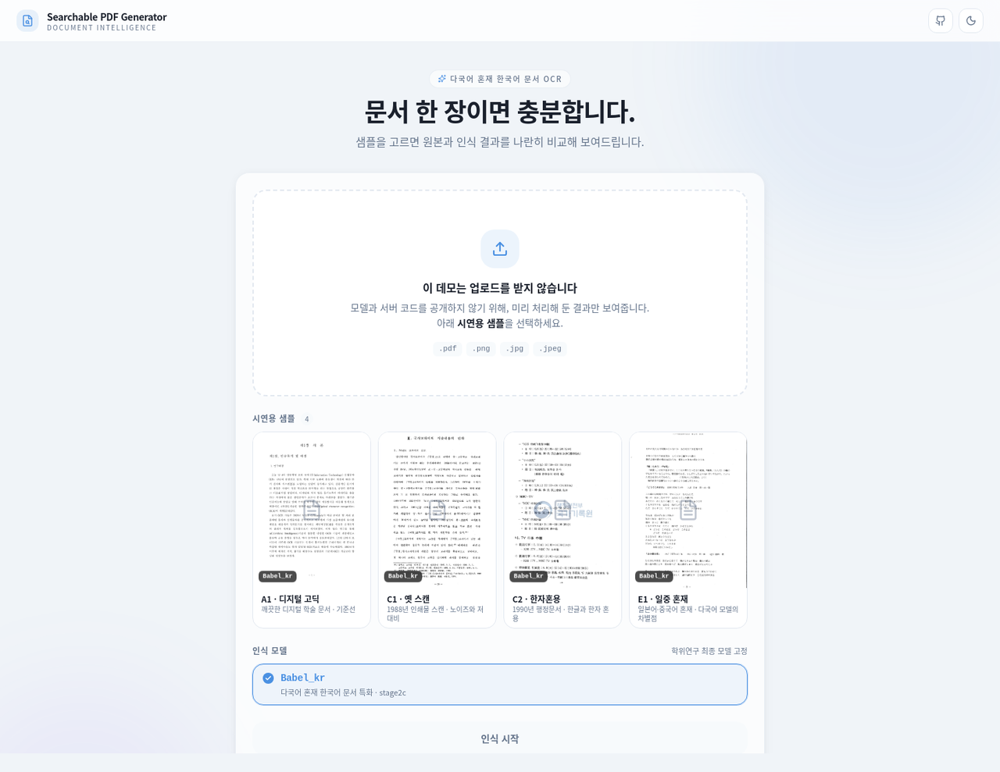

# Searchable PDF Generator

> 스캔·이미지 문서를 **검색 가능한 PDF**로 바꿔주는 OCR 서비스입니다.
> 원본 텍스트 박스의 위치를 감지하고, OCR 결과를 투명한 텍스트로 해당 위치에 삽입하여 마치 디지털 문서인 것처럼 변환할 수 있습니다.

공개된 버전은 데모 버전으로, OCR 모델을 미포함하여 실제로 연산하지는 않습니다.

**[데모 열기](https://dnss1.github.io/searchable-pdf-generator/)**

## Searchable PDF의 이점

종이 문서를 단순히 스캔하면 사람 눈으로는 글자를 식별할 수 있지만,
디지털 처리에 사용할 수는 없습니다.
Searchable PDF Generator는 이러한 언어 자원의 소실을 방지하기 위한 도구입니다.

이 서비스는 문서 이미지를 받아

1. **글자가 있는 영역을 찾고** (텍스트 검출)
2. **그 영역의 글자를 읽고** (문자 인식)
3. **사람이 읽는 순서대로 정렬한 뒤** (다단·세로쓰기 처리)
4. **원본 이미지 위에 보이지 않는 텍스트 층을 겹쳐** PDF로 만듭니다.

결과 PDF는 겉보기엔 원본과 똑같지만, `Ctrl+F`로 검색하고 드래그해서 복사할 수 있습니다.

---

## 🛠 기술 스택

| 영역 | 사용 기술 |
|---|---|
| 인식 모델 | PaddleOCR (PP-OCRv5), CTC / NRTR, TRDG 합성 데이터 |
| 데이터·평가 | Python, OpenCV, NumPy, PyMuPDF |
| 서비스 화면 | Next.js 14, TypeScript, Tailwind CSS |
| 배포 | GitHub Actions → GitHub Pages (정적 빌드) |
