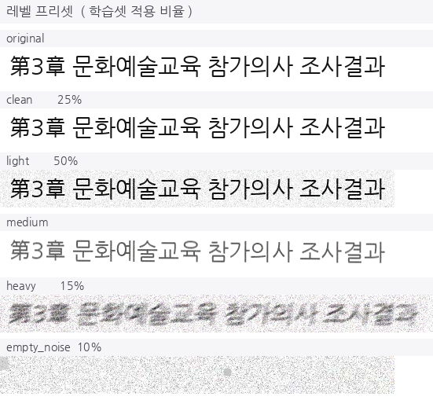

# Searchable PDF Generator

> 스캔·이미지 문서를 **검색 가능한 PDF**로 바꿔주는 OCR 서비스입니다.
> 원본 텍스트 박스의 위치를 감지하고, OCR 결과를 투명한 텍스트로 해당 위치에 삽입하여 마치 디지털 문서인 것처럼 변환할 수 있습니다.

공개된 버전은 데모 버전으로, OCR 모델을 미포함하여 실제로 연산하지는 않습니다.

**👉 [데모 열기](https://dnss1.github.io/searchable-pdf-generator/)**

## Searchable PDF의 이점

종이 문서를 단순히 스캔하면 사람 눈으로는 글자를 식별할 수 있지만,
디지털 처리에 사용할 수는 없습니다.
Searchable PDF Generator는 이러한 언어 자원의 소실을 방지하기 위한 도구입니다.

이 서비스는 문서 이미지를 받아

1. **글자가 있는 영역을 찾고** (텍스트 검출)
2. **그 영역의 글자를 읽고** (문자 인식)
3. **사람이 읽는 순서대로 정렬한 뒤** (다단·세로쓰기 처리)
4. **원본 이미지 위에 보이지 않는 텍스트 층을 겹쳐** PDF로 만듭니다.

결과 PDF는 겉보기엔 원본과 똑같지만, `Ctrl+F`로 검색하고 드래그해서 복사할 수 있습니다.

일반 OCR 모델은 한국어 문서에 **한자·일본어가 섞이면 크게 무너집니다.**
공식 한국어 모델로는 일중 혼재 문서 정확도가 30%대였고, 이를 다국어 미세조정으로 **89.96%** 까지 끌어올렸습니다.

---


## 📊 성능

PP-OCRv5를 4단계 전이 학습으로 미세조정한 결과입니다. 비교 대상은 PaddleOCR 공식 한국어 특화 모델이고, 같은 평가 스크립트 · 같은 검출 단계 기준입니다.

| 평가셋 | 지표 | 공식 한국어 모델 | 본 연구 | 개선 |
|---|---|---:|---:|---:|
| 자체 구축 75p · 2,199라인 | Char Acc | 83.81% | **96.24%** | +12.43%p |
| KCI 학술논문 · 5p | F1 | 75.39% | **97.13%** | +21.74%p |
| 옛 행정 타자본 · 3,564라인 | Char Acc | 88.13% | **94.58%** | +6.45%p |
| 옛 행정 타자본 · 3,564라인 | F1 | 64.01% | **83.62%** | +19.61%p |

도메인별로는 일중 혼재 **+59.46%p**(30.50 → 89.96), 옛 스캔 **+29.73%p**(64.31 → 94.04), 한자혼용 **+17.61%p** 개선했습니다.
순수 한국어 문서에서도 한국어 전용 모델을 앞섰습니다 — 다국어 학습이 표현을 공유해 얻는 이득입니다.

<!-- 📸 (선택) 학습 곡선 이미지를 보여주고 싶다면 아래 줄 유지 -->


모든 수치의 원본은 [`research/results/all_models_all_datasets.json`](research/results/all_models_all_datasets.json) 에 있습니다.

### 데모 샘플 4종

| 도메인 | 문서 | 라인 | 데모 평균 신뢰도 | 논문 Char Acc | Stage 1 대비 |
|---|---|---:|---:|---:|---:|
| A1 · 디지털 고딕 | 깨끗한 학술 문서 · 기준선 | 23 | 0.949 | 97.00% | +5.80%p |
| C1 · 옛 스캔 | 1988년 인쇄물 · 노이즈와 저대비 | 47 | 0.945 | 94.04% | +29.73%p |
| C2 · 한자혼용 | 1990년 행정문서 · 한글+한자 | 28 | 0.932 | 96.17% | +17.61%p |
| E1 · 일중 혼재 | 일본어·중국어 혼재 | 37 | 0.983 | 89.96% | +59.46%p |

4장 모두 학위연구에서 직접 구축한 평가셋(75페이지 / 8도메인)에 수록된 페이지이고,
화면의 결과는 **논문 최종 모델이 실제로 인식한 값**입니다.
데모 신뢰도는 페이지 한 장 기준이라 벤치마크 수치와 직접 비교할 값은 아닙니다.

---

## 🔍 문제 해결 기록

### 같은 가중치, 다른 결과

처음엔 운영 서비스로 데모 결과를 뽑았는데 일부 줄이 깨졌습니다. 가중치는 같았는데도요.

원인은 **인식 입력 폭**이었습니다. 서비스는 속도를 위해 검출 해상도를 낮추고 인식 입력을 기본값(320px)으로 두는데,
그러면 긴 줄이 좁은 입력에 압축되어 글자가 뭉개집니다. 50자를 320px에 넣으면 글자당 6.4px인데,
한자·한글을 구분하려면 12~16px이 필요합니다. 학위연구에서 진단했던 병목과 같은 현상이었습니다.

```
서비스 설정   det_limit 1200 · rec_image_shape 기본      → E1 평균 0.955, 깨진 라인 2건
논문 설정     det_limit 2000 · rec_image_shape 3,48,1280 → E1 평균 0.983, 깨진 라인 0건
```

[`tools/run_paper_pipeline.py`](tools/run_paper_pipeline.py) 가 논문 설정을 그대로 재현합니다.

### 지표가 서로 반대 신호를 낼 때

학술논문 평가에서 **문자 정확도 47%, F1 97%** 가 동시에 나왔습니다.
2단 레이아웃의 좌·우 단이 한 줄로 합쳐져, 글자는 다 맞았는데 순서만 틀린 경우였습니다.
이후 평가 단위별로 주 지표를 나누고, 오류를 유형별로 분해하는 [평가 프레임워크](ocr_eval/)를 만들었습니다.

잔존 오류 14.11% 중 **11.08%가 정답 라벨의 공백 불일치**였다는 것도 이 분해로 찾았습니다.

### 합성 데이터의 한계

합성 검증셋 96.51%였던 정확도가 실제 문서에서 85.58%로 떨어졌습니다. 합성 이미지에 실제 인쇄물의 열화가 없었기 때문입니다.
옛 스캔 문서를 관찰해 **긁힘 · 잉크 얼룩 · 스캐너 음영 · 입자감** 증강을 직접 구현했고([`ocr_augment/`](ocr_augment/)),
옛 스캔 도메인이 64.31% → **94.04%** 가 되었습니다.



---

## 🛠 기술 스택

| 영역 | 사용 기술 |
|---|---|
| 인식 모델 | PaddleOCR (PP-OCRv5), CTC / NRTR, TRDG 합성 데이터 |
| 데이터·평가 | Python, OpenCV, NumPy, PyMuPDF |
| 서비스 화면 | Next.js 14, TypeScript, Tailwind CSS |
| 배포 | GitHub Actions → GitHub Pages (정적 빌드) |
