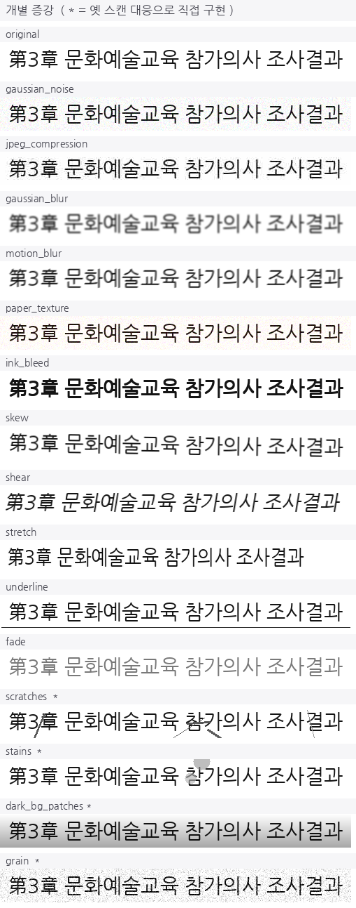

# ocr_augment — 문서 OCR 학습 증강

문서 OCR 인식 모델 학습용 이미지 증강 모음. **합성 텍스트 라인을 실제 인쇄·스캔 문서의 열화 분포에 가깝게** 만드는 후처리입니다.

한국어 다국어 혼합 문서(학술논문 · 행정 타자본 · 옛 스캔 · 한자혼용) OCR 인식 모델을 미세조정하면서, 합성 데이터로만 학습한 모델이 실문서에서 무너지는 문제를 해결하려고 만들었습니다.

```bash
pip install -r requirements.txt
python examples/make_grid.py          # 아래 그리드 이미지를 직접 생성해 봅니다
```

---

## 왜 만들었나

합성 검증셋에서 **96.51%** 였던 인식 정확도가 실제 문서에서 **85.58%** 로 떨어졌습니다.

원인을 분해해 보니 합성 이미지에는 실제 인쇄물의 열화가 전혀 없었습니다. 1980~90년대 행정 타자본에는 스캐너 음영, 긁힘, 잉크 얼룩, 종이 입자가 섞여 있는데 학습 데이터는 전부 깨끗한 흰 배경이었습니다.

기존 증강 라이브러리(imgaug, albumentations)에는 일반 비전용 노이즈는 있어도 **문서 스캔 특유의 열화**가 없어서, 대상 도메인을 직접 관찰하고 4종을 구현해 추가했습니다.

이 증강을 적용한 뒤 옛 스캔 도메인 문자 정확도가 **64.31% → 94.04%** 로 올랐습니다.

---

## 개별 증강 15종

`*` 표시가 옛 스캔 도메인을 관찰하고 직접 구현한 것입니다.

| 함수 | 재현하려는 현상 |
|---|---|
| `add_gaussian_noise` | 센서 노이즈 |
| `add_jpeg_compression` | 저품질 JPEG 재인코딩 아티팩트 |
| `adjust_brightness_contrast` | 스캔 노출 편차 |
| `add_gaussian_blur` | 초점 흐림 |
| `add_motion_blur` | 스캔 중 이송 흔들림 |
| `add_paper_texture` | 종이 결 |
| `add_ink_bleed` | 잉크 번짐 (글자 두꺼워짐) |
| `add_skew` | 원고 기울어짐 (±1°) |
| `add_shear` | 이탤릭체 / 기울어진 활자 |
| `add_stretch` | 폰트 메트릭 편차 |
| `add_underline` | 밑줄 |
| `add_fade` | 저대비 · 퇴색 |
| `add_scratches` `*` | 옛 스캔·마이크로필름의 긁힘 선 |
| `add_stains` `*` | 잉크 번짐 자국 · 먼지 얼룩 |
| `add_dark_bg_patches` `*` | 스캐너 음영, 배경 제거 실패로 남은 어두운 영역 |
| `add_grain` `*` | 옛 신문 특유의 입자감 배경 |



---

## 레벨 프리셋

개별 증강을 확률 조합한 프리셋입니다. 괄호 안은 학습셋 적용 비율입니다.

| 레벨 | 비율 | 대응 도메인 |
|---|---:|---|
| `clean` | 25% | 디지털 PDF (원본 유지) |
| `light` | 50% | 일반 인쇄물 |
| `heavy` | 15% | 옛 스캔 · 마이크로필름 |
| **`empty_noise`** | **10%** | **텍스트 없는 배경 — 아래 설명** |


### `empty_noise` — 상류 오류를 하류에서 흡수하기

이 10%가 이 저장소에서 가장 설명이 필요한 부분입니다.

OCR은 보통 **검출(detection) → 인식(recognition)** 2단 파이프라인입니다. 검출 단계는 여백, 표의 괘선, 얼룩, 로고를 텍스트 영역으로 **오검출**합니다. 그러면 인식 단계에는 글자가 없는 크롭이 들어오는데, 글자만 학습한 인식 모델은 거기서도 억지로 뭔가를 출력합니다. 최종 결과에 정체불명의 문자열이 섞이는 원인입니다.

그래서 **텍스트 없는 배경 + 노이즈** 이미지를 레이블 `""` (빈 문자열)로 10% 섞어 학습시켰습니다. CTC가 blank만 출력하도록 학습되어, 검출이 틀려도 인식이 빈 문자열을 반환합니다.

검출기를 고치는 대신 **인식기가 상류 오류를 흡수하도록** 만든 설계입니다.

```python
augmented, level = random_augment(img)
label = "" if level == "empty_noise" else original_label   # 레이블 교체가 핵심
```

---

## 사용법

### 디렉토리 일괄 처리

`labels.txt`(`파일명 <텍스트>` 형식)가 같은 폴더에 있으면 함께 재작성합니다. `empty_noise`로 처리된 항목은 레이블이 자동으로 빈 문자열이 되고, 지정 폭을 넘는 이미지는 제외됩니다.

```bash
python -m ocr_augment.augment --input data/train --output data/train_aug
python -m ocr_augment.augment --input data/train --output data/train    # in-place
python -m ocr_augment.augment --input data/train --output data/train_aug --max_width 1280
```

### 개별 호출

```python
import cv2
from ocr_augment import add_scratches, augment_heavy, random_augment

img = cv2.imread("line.png")

img = add_scratches(img, count_range=(2, 5))   # 증강 하나만
img = augment_heavy(img)                       # 프리셋
img, level = random_augment(img)               # 비율대로 무작위 선택
```

### 비율 바꾸기

`augment.py` 의 `random_augment()` 하나만 고치면 됩니다.

```python
def random_augment(img):
    r = random.random()
    if r < 0.25:   return augment_clean(img), 'clean'
    elif r < 0.75: return augment_light(img), 'light'
    elif r < 0.90: return augment_heavy(img), 'heavy'
    else:          return augment_empty_noise(img), 'empty_noise'
```

---

## 적용 결과

PP-OCRv5 기반 한국어 다국어 혼합 문서 인식 모델을 미세조정하면서 측정한 값입니다. 증강 단독 효과가 아니라 코퍼스 재설계·실문서 라벨 학습과 함께 적용한 결과입니다.

| 평가 도메인 | 적용 전 | 적용 후 |
|---|---:|---:|
| 옛 스캔 (1980~90년대 타자본) | 64.31% | **94.04%** |
| 한자혼용 | 78.56% | **96.17%** |
| 일중 혼재 | 30.50% | **89.96%** |
| 전체 (8도메인 · 2,199라인) | 85.58% | **96.24%** |

문자 정확도 기준. 평가 프레임워크는 [`ocr_eval/`](../ocr_eval/) 참고.

---

## 알아둘 것

- 증강은 **학습셋에만** 적용하세요. 검증셋에 적용하면 성능 측정이 왜곡됩니다
- `add_skew` 는 ±1° 범위입니다. 각도를 키우면 라인 크롭에서 글자가 잘립니다
- `random.seed(42)` 가 모듈 상단에 고정되어 있습니다. 매번 다른 결과가 필요하면 바꾸세요
- 입력은 OpenCV BGR `ndarray` 입니다 (`cv2.imread` 출력 그대로)

## 라이선스

MIT
